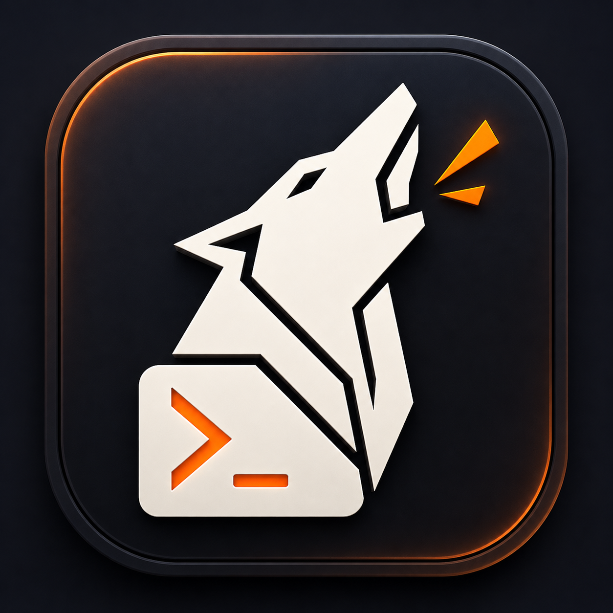

<p align="center">
  
</p>

<h1 align="center">Howl</h1>

<p align="center">
  An observable, embeddable terminal and session engine written in Zig.
</p>

## About

Howl is a small native terminal family built from independently composable
state machines. Terminal semantics, process transport, visual projection, GPU
rendering, and window presentation have separate owners and can be used
together or independently.

The goal is not only another terminal application. Howl is intended to become
a foundation for embedded terminals, persistent local or remote sessions,
test simulators, and a new form of multiplexed work.

## Why

Software work no longer belongs to one person typing into one foreground
shell. A human may be steering an editor while several agents investigate,
build, test, or operate long-running processes across local and remote
machines. The work is related, but its state is scattered across terminal
windows, transcripts, logs, chat histories, process managers, and automation
systems. Humans lose context when work becomes automatic; agents lose context
when work remains trapped in interfaces designed only for humans.

Traditional multiplexers preserve byte streams and arrange terminal panes.
That remains useful, but it is not enough for cooperative work. Howl is working
toward durable sessions whose terminal state, process ownership, mutations,
history, and presentation are explicit and observable. Humans and agents should
be able to share the same authoritative session, hand work over, inspect what
happened, intervene safely, and reconnect without reconstructing truth from
prose logs or screenshots.

This is why Howl begins below the user interface. Its terminal, process,
rendering, and presentation state machines are independent building blocks with
typed boundaries and deterministic evidence. The graphical host pressures those
pieces today; persistent cooperative sessions can compose them later without
turning one terminal application into the architecture.

Howl favors explicit bounds, typed mutations, monotonic identities,
transactional state changes, deterministic replay, and exact rollback. The
first-party graphical host exists both as a useful terminal and as continuous
pressure on the reusable packages beneath it.

Howl is private, experimental software under active development. Its package
interfaces and runtime behavior are not stable yet.

## Architecture

| Package | Owns |
| --- | --- |
| `howl-vt` | Terminal parsing, semantic state, mutation facts, replies, input encoding, images, history, and reflow |
| `howl-pty` | Bounded Linux PTY transport and child-process lifecycle |
| `howl-render` | Backend-neutral projection, shaping, generated terminal glyphs, retained resources, and composition |
| `howl-vk` | Reusable Vulkan ABI, external-image dispatch, residency, staging, and recording |
| `howl-wayland` | Reproducible Wayland protocols, input facts, and keyboard state |
| `howl-host` | The first-party Wayland, Vulkan, DMA-BUF, explicit-sync, tabs, panes, and terminal-runtime composition |

Each `howl-*` directory is an independent Zig package with its own dependencies
and proofs. The repository root is a development workspace and exports no
product module.

## Current state

Howl is currently `0.1.4-dev`.

The terminal model, Linux PTY owner, native and generated text machinery,
backend-neutral compositor, reusable Vulkan and Wayland foundations, and a
multi-pane graphical host are working. Kitty-compatible Unicode occupancy,
grapheme storage, ligatures, symbols, generated terminal glyphs, factual DPI,
fractional scaling, and pane-local font sizing have deterministic coverage.

The `0.1.3-dev` milestone separated cursor mutation, publication,
cursor-free terminal frames, synchronized-output deferral, physical replay,
and Kitty-led trail presentation into composable state machines. The active
`0.1.4-dev` milestone separates session-domain decisions from Host integration,
then completes ordered keyboard, repeat, shortcut, pointer, and terminal mouse
routing under the `xterm-kitty` development compatibility profile.

Howl is not yet a complete daily terminal. Stable embedding APIs, persistent
detached sessions, cooperative session control, complete interaction features,
performance parity, maximum-pressure admission, packaging, and compatibility
commitments remain future work. The planned multiplexing-like mode is not a
tmux port or compatibility project. It will rethink session interaction and
ownership around humans and agents sharing, transferring, and supervising live
work.

## Plan

| Milestone | Status |
| --- | --- |
| Bounded terminal semantics and Linux process transport | Accepted |
| Native text, terminal glyphs, composition, Vulkan, and Wayland foundations | Accepted |
| First-party multiplexed graphical host | In progress |
| Cursor correctness, animation, blink, and presentation reassessment | Active |
| Performance and maximum multi-pane pressure | Planned |
| Stable embedding surfaces | Planned |
| Persistent cooperative sessions for human and AI teams | Planned |

## Build

Howl uses the exact Zig version recorded in `.zigversion`:

```sh
version=$(cat .zigversion)
mkdir -p .zig
ln -sfn "$HOME/.local/share/zigup/$version/files/zig" .zig/zig
test "$(./.zig/zig version)" = "$version"
```

Build every active package:

```sh
./.zig/zig build
```

Run the workspace proofs:

```sh
./.zig/zig build test
```

Commands inside a child package use `../.zig/zig`.
